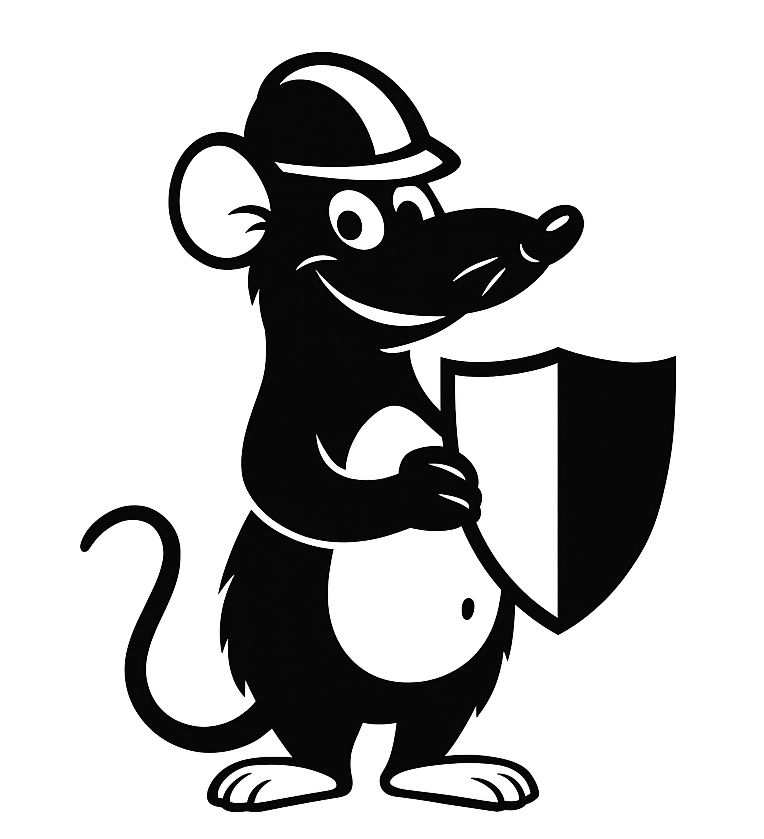
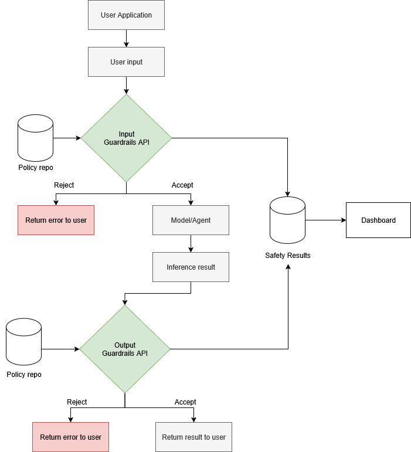

<p align="center">
  
  <h1 align="center">Guardrails for AI Safety and Reliability</h1>
  <a href="https://www.python.org/downloads/release/python-3120/">
    
  </a>
  <a href="https://github.com/astral-sh/uv">
    
  </a>
  <a href="https://fastapi.tiangolo.com/">
    
  </a>
  <a href="https://www.postgresql.org/about/news/postgresql-175-released-2770/">
    
  </a>
</p>

Guardrails for AI Safety and Reliability is a modular API designed to help teams implement AI safety best practices out-of-the-box. This project provides a unified interface for running safety and reliability checks on generative AI outputs, making it easy to integrate robust guardrails into any in-house GenAI product.

**Key Features:**
- **Plug-and-play API:** Easily connect the guardrail API to any LLM-based system you develop, regardless of model or platform.
- **Comprehensive Safety Checks:** Automatically screen for toxicity, bias, ethics, PII, secrets, prompt safety, Tool Alignment and Code Shield
- **Configurable & Extensible:** Customize guardrails and thresholds to fit your use case, and extend with new rules as needed. The guardrails actions can be configured to block/allow/human-in-the-loop.

This project helps you ship safer, more reliable AI applications with minimal effort, so you can focus on building value while reducing risk.



The above diagram illustrates the end-to-end workflow of the Guardrails for AI Safety and Reliability API. 

**Input Guardrails**
 - **Toxicity:** Detects and flags content that is severely toxic, generally toxic, obscene, threatening, insulting, or sexually explicit, using a configurable threshold and validation method.
  - **Bias:** Identifies and scores content for physical, socioeconomic, gender, racial, or age-related bias to help mitigate discriminatory outputs.
  - **Ethics:** Screens for ethical concerns across multiple frameworks, including consequentialist, deontological, virtue ethics, care ethics, and social justice ethics.
  - **PII (Personally Identifiable Information):** Checks for the presence of sensitive information such as email addresses, phone numbers, IP addresses, locations, personal names, Singapore NRIC/FIN, UEN, and URLs to prevent privacy leaks.
  - **Secrets:** Detects accidental leakage of confidential data such as user IDs, passwords, API keys, and encryption keys.
  - **Prompt Safety:** Identifies adversarial prompts, direct prompt injection attempts, and jailbreak techniques to defend against prompt-based attacks.


**Output Guardrails**
  - **Tool Alignment (Output):** Assesses whether the agent's tool usage and reasoning are properly aligned with the user's intended objective.
  - **Code Shield (Output):** Evaluates generated code for the use of unsafe, unauthorized, or potentially harmful code patterns.

## Guardrails dependencies

- gliner
- Presidio-analyzer
- Llama-firewall
- detoxify
- regex
- Aurelio semantic_router


## Install 

To setup environment,install dependencies and create empty db tables, clone the repo, cd into the root folder and run : 

```
pip install -e .
```

## Launch servers

To launch the input and output guardrails API servers (and a simple langgraph agent server) please run : 

```
uv run server.py
```

You should see three servers running : 
- Agent : http://0.0.0.0:8000, 
- Input guardrails : http://0.0.0.0:8001
- Output guardrails : http://0.0.0.0:8002

